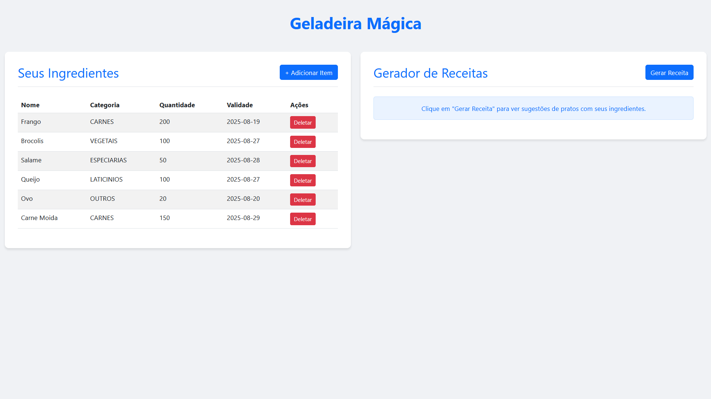

# 🧊 Geladeira Mágica

Uma aplicação desenvolvida em **Java + Spring Boot** que permite gerenciar sua geladeira de forma simples,  
gerando sugestões de receitas com os ingredientes disponíveis, integrada com a **API do Gemini** via **Spring AI**.

---

## 🚀 Tecnologias Utilizadas


---

## 📂 Estrutura do Projeto

A estrutura segue o padrão de projetos Spring Boot, com separação por camadas:

```
│
├── Config
│ └── WebClientConfig.java
│
├── Controller
│ └── (controllers da aplicação)
│
├── DTOs
│ └── FoodItemDTO.java
│
├── Enums
│ └── FoodCategory.java
│
├── Mapper
│ └── FoodItemMapper.java
│
├── Model
│ └── FoodItem.java
│
├── Repository
│ └── FoodItemRepository.java
│
├── Service
│ ├── ChatService.java
│ └── FoodItemService.java
│
└── MagicFridgeAiApplication.java
```

## Configuração
1 - Configure as variáveis de ambiente no arquivo `.env` de acordo com .env-example e tbm no intellij adicione as variáveis de ambiente.:
```
DATABASE_URL=jdbc:h2:mem:testdb;DB_CLOSE_ON_EXIT=FALSE;DB_CLOSE_DELAY=0
DATABASE_USERNAME=cadastro_ex
DATABASE_PASSWORD=cadastro_ex

GEMINI_API_KEY=sua_key_do_gemini
```
2 - Execute a aplicação através do IntelliJ ou via terminal com o comando:
```
./mvnw spring-boot:run
```

3 - Acesse a API via Swagger UI em:
```
http://localhost:8080/swagger-ui/index.html
```

4 - Acesse a UI do projeto em:
```
http://localhost:8080/food/ui/dashboard
```

## Endpoints Principais
- `POST /food`: Adiciona um novo item à geladeira.
- `GET /food`: Lista todos os itens na geladeira.
- `GET /food/{id}`: Recupera um item específico por ID.
- `PATCH /food/{id}`: Atualiza um item existente.
- `DELETE /food/{id}`: Remove um item da geladeira.
- `GET /generate`: Gera sugestões de receitas com base nos ingredientes disponíveis.
